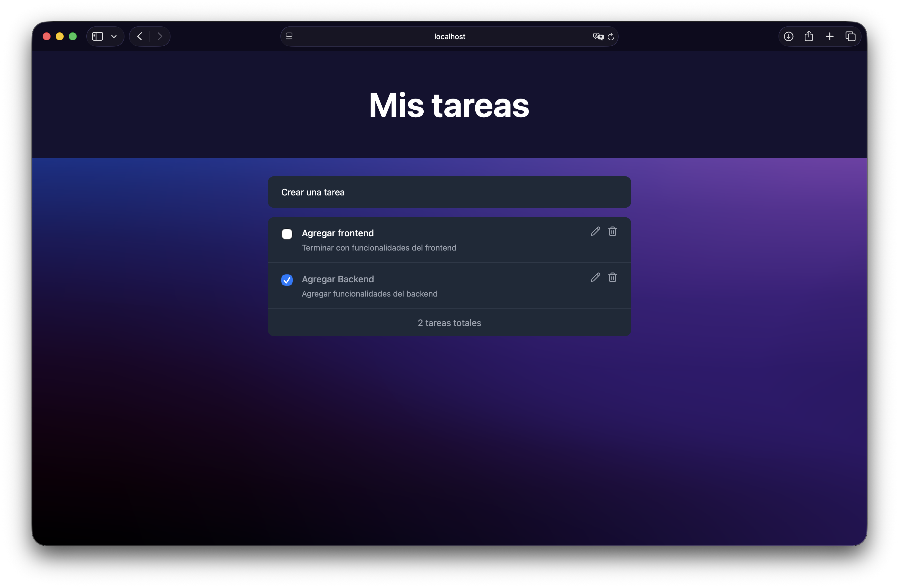
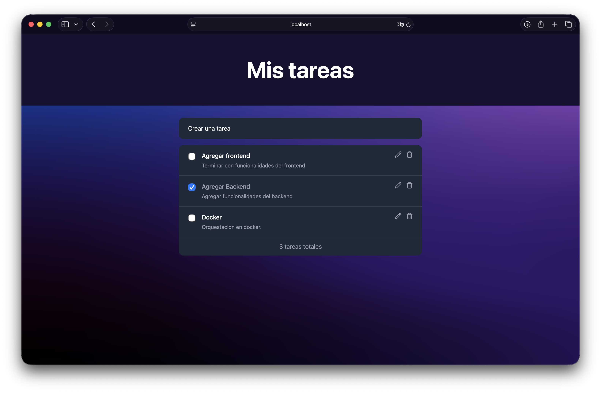
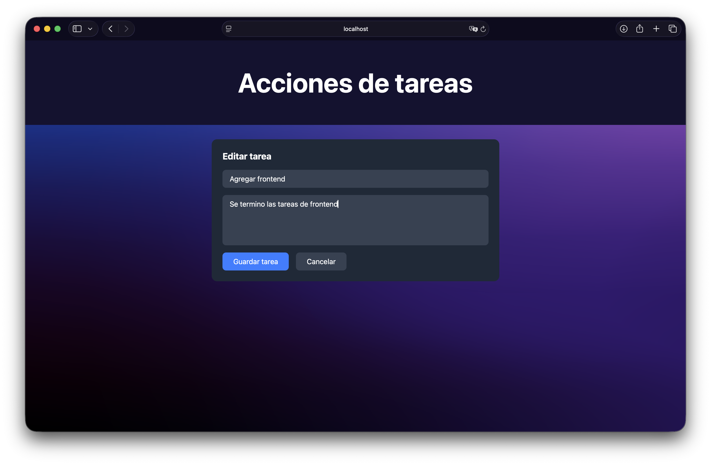
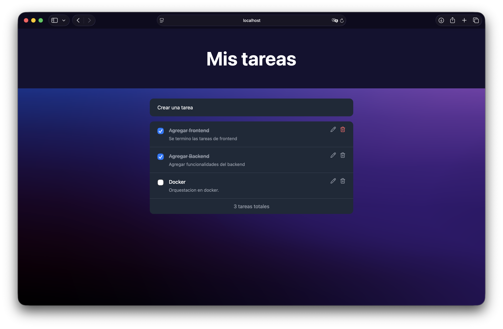
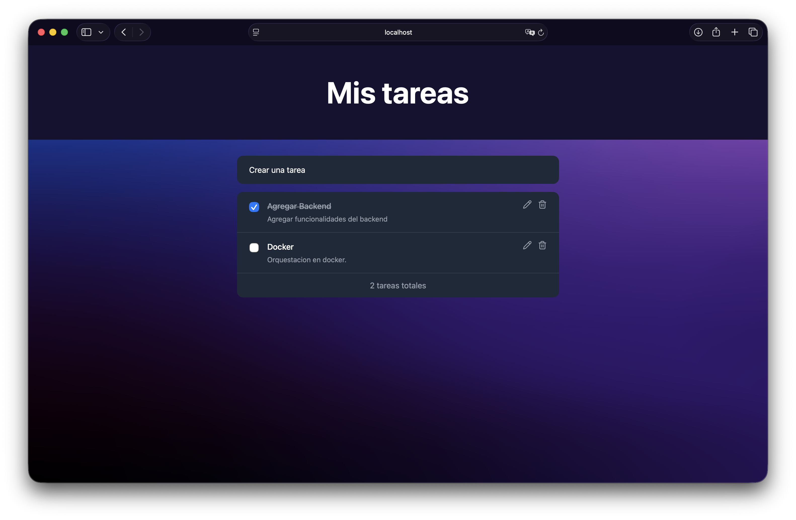
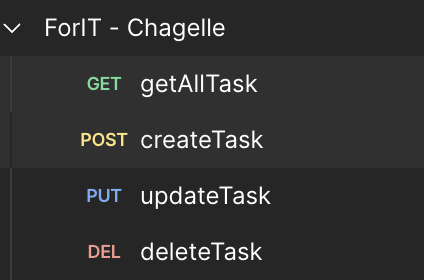

# Challenge ForIT 2026 — Aplicación de Lista de Tareas

Aplicación fullstack de gestión de tareas desarrollada como parte del challenge de ingreso a ForIT 2026.

---

## Tecnologías utilizadas

**Backend**
- Node.js
- Express
- dotenv

**Frontend**
- React + TypeScript
- Vite
- Tailwind CSS
- React Router DOM
---

## Funcionalidades

- Crear, leer, actualizar y eliminar tareas (CRUD completo)
- Marcar tareas como completadas
- Separación de responsabilidades (servicios, componentes, interfaces)
- Variables de entorno en backend y frontend

---

## Bonus implementados

- Configuración de Docker para levantar tanto el backend como el frontend en contenedores
- TypeScript en el frontend
- Tailwind CSS para los estilos
- Buenas prácticas de arquitectura inspiradas en Java/Spring Boot (separación en capas)

---

## Estructura del proyecto

```
Challenge-ForIT-2026/
├── backend/
│   ├── src/
│   │   ├── controller/
│   │   │   └── taskController.js
│   │   ├── model/
│   │   │   └── task.js
│   │   ├── servicio/
│   │   │   └── taskService.js
│   │   └── index.js
│   ├── .env
│   └── package.json
├── frontend/
│   ├── public/
│   ├── src/
│   │   ├── assets/
│   │   ├── components/
│   │   │   ├── TaskForm.tsx
│   │   │   ├── TaskItem.tsx
│   │   │   └── TaskList.tsx
│   │   ├── interface/
│   │   │   └── task.ts
│   │   ├── pages/
│   │   │   └── Home.tsx
│   │   ├── service/
│   │   │   └── taskService.ts
│   │   ├── App.css
│   │   ├── App.tsx
│   │   ├── index.css
│   │   └── main.tsx
│   ├── .env
│   └── package.json
└── imagenes/
```

---

## Ejecutar proyecto con Docker (Plus)

El proyecto cuenta con configuración de Docker para levantar tanto el backend como el frontend en contenedores.

### Requisitos previos

- Docker
- Docker Compose

### Cómo levantar con Docker

```bash
docker-compose up --build
```

Esto levanta los dos servicios automáticamente:

| Servicio | URL |
|----------|-----|
| Backend | http://localhost:3000 |
| Frontend | http://localhost:5174 |

### Para detener los contenedores

```bash
docker-compose down
```

### Estructura de Docker

- `backend/Dockerfile` — imagen basada en Node 18 Alpine
- `frontend/Dockerfile` — imagen basada en Node 22 Alpine (requerido para compatibilidad con Vite)
- `docker-compose.yml` — orquesta ambos contenedores, el frontend depende del backend

## Cómo ejecutar el proyecto localmente (Sin docker)

### Requisitos previos

- Node.js v22 o superior
- npm

### 1. Clonar el repositorio

```bash
git clone https://github.com/IvanBecerra1/Challenge-ForIt-2026.git
cd Challenge-ForIt-2026
```

### 2. Configurar el backend

```bash
cd backend
npm install
```

Iniciar el servidor:

```bash
npm run dev
```

El backend corre en `http://localhost:3000`

### 3. Configurar el frontend

Abrir otra terminal:

```bash
cd frontend
npm install
```

Iniciar el frontend:

```bash
npm run dev
```

El frontend corre en `http://localhost:5173`

---

## Endpoints de la API

| Método | Endpoint | Descripción |
|--------|----------|-------------|
| GET | /api/tasks | Obtener todas las tareas |
| POST | /api/tasks | Crear una nueva tarea |
| PUT | /api/tasks/:id | Actualizar una tarea existente |
| DELETE | /api/tasks/:id | Eliminar una tarea |

## Colección de Postman

En la raíz del repositorio se encuentra el archivo `ForIT - Chagelle.postman_collection.json` que podés importar en Postman para probar todos los endpoints de la API.

### Cómo importarlo

1. Abrí Postman
2. Hacé click en **Import**
3. Seleccioná el archivo `ForIT - Chagelle.postman_collection.json`
4. Todas las peticiones van a aparecer listas para usar

---

## Screenshots

### Home — Lista de tareas


### Crear tarea


### Tarea creada


### Editar tarea


### Tarea actualizada


### Antes de eliminar


### Tarea eliminada


### Prueba de API con HTTP Client


